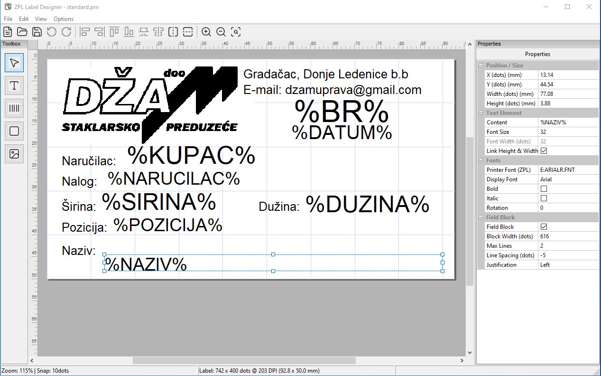

# ZPL Label Designer

A WYSIWYG label designer for Zebra ZPL printers, built with C++ and wxWidgets. Design labels graphically — place and edit elements visually, and the app generates ZPL code automatically. No manual ZPL editing required.


---

## Features

### Label Design
- Visual WYSIWYG canvas with zoom, pan (middle mouse), and grid snapping
- Configurable label size, DPI, margins, and orientation (Portrait / Landscape)
- Multi-label layout support (multiple columns per media strip)
- Rulers and snap-to-grid with configurable grid size (2 / 5 / 10 dots or custom)
- Marquee (rubber-band) selection for selecting multiple elements at once

### Elements
| Element | ZPL Commands |
|---------|-------------|
| **Text** | `^FO`, `^FD`, `^A`, `^CF` |
| **Barcode** | `^BC`, `^BQ`, `^BE`, `^B3`, `^BA` and more |
| **Box / Shape** | `^GB`, `^GC`, `^GD`, `^GE` (rectangle, circle, ellipse, diagonals) |
| **Image** | `^GF` (BMP embedded as hex) |

### Editing
- Click to place elements; drag to move; 8-handle resize
- Multi-select with Shift+Click or rubber-band drag
- Full Undo / Redo (Ctrl+Z / Ctrl+Y) for all operations
- Duplicate element (Ctrl+D)
- Delete (Delete key)
- Bring to Front / Send to Back

### Alignment Tools
- Align left / right / top / bottom edges of selected elements
- Align horizontal or vertical centers of selected elements (relative to each other)
- Center element(s) horizontally or vertically on the label

### Properties Panel
- Per-element properties via a side panel
- Text: content, font size, font width (with linked height/width option), rotation, bold, italic, printer font path, display font, field block (word wrap)
- Barcode: type, data, bar height, show text, check digit
- Box: shape type, border thickness, border/fill color
- Image: file path
- Position and size in dots, with display in mm or inches based on app units setting

### ZPL Integration
- Live ZPL code panel (toggle with Ctrl+Shift+Z or View menu)
- Open existing `.zpl` / `.prn` files — parses and reconstructs the element model
- Save / Save As as `.zpl` or `.prn`
- DPI selection dialog when opening ZPL files (152 / 203 / 300 / 600 DPI)

### Other
- Two UI languages: **English** and **Serbian** (Srpski)
- Metric (mm) and Imperial (inches) units
- Recent files list
- Raw ZPL printing to any installed Windows printer
- Status bar showing zoom level, snap state, label dimensions and DPI, cursor position

---

## Screenshots



---

## Requirements

### Build environment
- **Windows** (Windows 10 or later recommended)
- **MSYS2** with the UCRT64 toolchain — [msys2.org](https://www.msys2.org/)
- **CMake** ≥ 3.20
- **Ninja** build system
- **Git** (for fetching the Zint dependency)

### Install MSYS2 packages

Open an MSYS2 UCRT64 terminal and run:

```bash
pacman -S --needed \
  mingw-w64-ucrt-x86_64-gcc \
  mingw-w64-ucrt-x86_64-cmake \
  mingw-w64-ucrt-x86_64-ninja \
  mingw-w64-ucrt-x86_64-wxWidgets3.2
```

### Third-party libraries (auto-fetched)
- **[Zint](https://github.com/zint/zint)** 2.13.0 — barcode rendering, fetched automatically via CMake `FetchContent`

---

## Building

Open an **MSYS2 UCRT64** terminal (not PowerShell or cmd):

```bash
cd /c/path/to/ZPL-Editor

# Configure (Debug)
cmake -B build -G Ninja -DCMAKE_BUILD_TYPE=Debug

# Build
cmake --build build
```

For a Release build:

```bash
cmake -B build -G Ninja -DCMAKE_BUILD_TYPE=Release
cmake --build build
```

The executable will be at `build/ZPLEditor.exe`.

> **Note:** The build must be run from an MSYS2 UCRT64 terminal so that `wx-config` and the compiler are found on `PATH`. Running from a plain PowerShell or Developer Command Prompt will not work.

---

## Deployment

A PowerShell script is included to collect the executable and all required DLLs into a single `build/deploy/` folder:

```powershell
.\deploy.ps1
```

This copies `ZPLEditor.exe`, `libzint.dll`, all wxWidgets DLLs, GCC runtime DLLs, and required image/compression libraries into `build\deploy\`. That folder is self-contained and can be distributed to any Windows 10+ machine without installing MSYS2 or any other runtime.

### Required DLLs (all from `C:\msys64\ucrt64\bin\`)

| Category | DLLs |
|----------|------|
| GCC runtime | `libgcc_s_seh-1.dll`, `libstdc++-6.dll`, `libwinpthread-1.dll` |
| wxWidgets | `wxbase32u_gcc_custom.dll`, `wxmsw32u_core_gcc_custom.dll`, `wxmsw32u_aui_gcc_custom.dll`, `wxmsw32u_propgrid_gcc_custom.dll` |
| Image libs | `libpng16-16.dll`, `libjpeg-8.dll`, `libtiff-6.dll`, `libwebp-7.dll`, `libsharpyuv-0.dll`, `libLerc.dll` |
| Compression | `zlib1.dll`, `libdeflate.dll`, `liblzma-5.dll`, `libzstd.dll`, `libjbig-0.dll` |
| Misc | `libpcre2-16-0.dll` |

Windows system DLLs (`kernel32.dll`, `ucrtbase.dll`, etc.) are already present on every Windows installation and do not need to be shipped.

---

## Supported DPI Values

| DPI | Dots/mm | Common use |
|-----|---------|------------|
| 152 | 6.0 | Older / low-res |
| 203 | 8.0 | Most common (default) |
| 300 | 11.81 | High resolution |
| 600 | 23.62 | Ultra high resolution |

> ZPL files do not embed DPI information. When opening a `.zpl` file, the app asks which DPI the label was designed for.

---

## Project Structure

```
ZPL-Editor/
├── CMakeLists.txt
├── deploy.ps1                  # Deployment helper script
├── app.ico / app.rc            # Application icon
├── src/
│   ├── main.cpp
│   ├── MainFrame.h/.cpp        # Main window, menus, toolbar, AUI layout
│   ├── LabelCanvas.h/.cpp      # WYSIWYG canvas (drawing, mouse, zoom, snap)
│   ├── ToolboxPanel.h/.cpp     # Tool selector sidebar
│   ├── PropertiesPanel.h/.cpp  # wxPropertyGrid properties panel
│   ├── ZPLCodePanel.h/.cpp     # Read-only ZPL code viewer
│   ├── I18n.h/.cpp             # Localization (EN / SR)
│   ├── AppConfig.h/.cpp        # Persisted settings
│   ├── ToolIcons.h             # SVG-based toolbar icons (HiDPI)
│   ├── elements/
│   │   ├── LabelElement        # Abstract base element
│   │   ├── TextElement         # Text / font
│   │   ├── BarcodeElement      # Barcodes via Zint
│   │   ├── BoxElement          # Shapes
│   │   └── ImageElement        # Embedded images
│   ├── commands/
│   │   ├── CommandHistory      # Undo/Redo stacks
│   │   ├── AddElementCommand
│   │   ├── MoveElementCommand
│   │   ├── ResizeElementCommand
│   │   ├── DeleteElementCommand
│   │   └── EditPropertyCommand
│   ├── zpl/
│   │   ├── ZPLSerializer       # Element model → ZPL text
│   │   ├── ZPLParser           # ZPL text → element model
│   │   └── ZPLTypes            # Enums, DPI constants
│   └── dialogs/
│       ├── NewLabelDialog      # New label wizard
│       └── AppOptionsDialog    # Units, language settings
```

---

## Keyboard Shortcuts

| Shortcut | Action |
|----------|--------|
| `Ctrl+N` | New label |
| `Ctrl+O` | Open ZPL file |
| `Ctrl+S` | Save |
| `Ctrl+Z` | Undo |
| `Ctrl+Y` | Redo |
| `Ctrl+D` | Duplicate element |
| `Ctrl++` | Zoom in |
| `Ctrl+-` | Zoom out |
| `Ctrl+0` | Zoom to fit |
| `Ctrl+Shift+Z` | Toggle ZPL code panel |
| `G` | Toggle snap to grid |
| `V` / `Esc` | Select / Move tool |
| `T` | Text tool |
| `B` | Barcode tool |
| `R` | Box / Shape tool |
| `I` | Image tool |
| `Delete` | Delete selected element(s) |
| Middle mouse drag | Pan canvas |
| `Ctrl+Mouse wheel` | Zoom |

---

## License

MIT License — see [LICENSE](LICENSE) for details.
